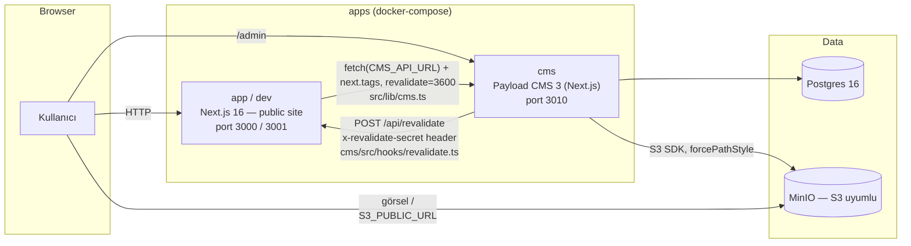

# T0 — Production Readiness Analizi

**Kapsam:** Bu doküman kod değiştirmez, sadece mevcut durumu (T0) tespit eder. Her iddia
`dosya:satır` referansıyla kanıtlanmıştır; kanıtlanamayan yerler açıkça "doğrulanmadı" olarak
işaretlenmiştir. Analiz tarihi: bu oturumun çalıştığı ana (worktree
`claude/selam-login-disable-temp-725fb7`, `main`'den ayrışmamış).

---

## 1. Executive Summary

Bu proje, gerçek bir markanın (Vodafone Pay — bir ödeme/fintech ürünü) web sitesinin AI ile
üretilmiş, "test/PoC amaçlı" bire bir klonu. Site tarafı (Next.js) ve içerik yönetimi
(Payload CMS + Postgres + MinIO) fonksiyonel olarak çalışıyor, temel ISR/revalidate akışı
kurulu, CMS admin paneli erişilebilir durumda. Bir demo/iç inceleme aracı olarak bugünkü hâliyle
kullanılabilir.

Production'a — yani gerçek kullanıcıya, gerçek trafiğe, gerçek finansal marka kimliğiyle —
çıkma senaryosu için proje **bugün hazır değil**. İki farklı katmanda blocker var:

1. **Hukuki/marka katmanı** — bu teknik bir eksiklik değil, bir karar meselesi. Aşağıdaki
   Bölüm 2'de detaylı.
2. **Teknik katman** — RBAC'ın dekoratif olması, secret yönetiminin dev default'larına
   dayanması, migration stratejisinin yokluğu ve tek bir testin bile bulunmaması, "yayına
   çıkmadan önce" değil "yayına çıkmayı düşünmeden önce" kapanması gereken maddeler.

**Karar: Conditional-Go.** Teknik borç, disiplinli bir Faz 1→3 çalışmasıyla makul bir sürede
kapatılabilir düzeyde (mimari temiz, sorunlar yaygın ama sığ — çoğu "eksik", "kırık" değil).
Ama hukuki/marka sorusu netleşmeden hiçbir teknik çalışma "production'a giden yol" sayılmamalı;
o soru cevaplanmadan Faz 3'ün (sertleştirme) bir anlamı yok.

---

## 2. P0 Bloklayıcılar

### 2.1 Hukuki & Marka — teknik borçtan ÖNCE gelir

Bu proje `vodafonepay.com.tr`'nin AI ile üretilmiş birebir kopyası:

- Gerçek marka fontları kullanılıyor (`public/fonts/vodafone-{regular,bold,light}.woff`,
  `src/app/layout.tsx:5-24`).
- Gerçek logo SVG'si birebir kopyalanmış (`public/images/vpay-logo.svg`, `cms/public/admin-logo.svg`
  — bu ikisi byte-byte aynı, doğrulandı).
- Gerçek hukuki metinler (gizlilik politikası, çerez politikası, kullanım şartları) site içinde
  kelimesi kelimesine duruyor (`src/app/gizlilik-ve-guvenlik-politikasi/page.tsx`,
  `src/app/cerez-politikasi/page.tsx`, `src/app/web-sitesi-hukum-ve-sartlari/page.tsx`).
- Gerçek marka görselleri (kampanya görselleri, ürün fotoğrafları) `public/images/` altında.
- Bu bir **ödeme/fintech markası** — yani yanlışlıkla yayına çıkması sadece marka/telif değil,
  finansal regülasyon (BDDK/TCMB kapsamı, e-para/ödeme kuruluşu lisanslaması) algısı da
  yaratabilir; sitede gerçek TCMB iletişim bilgileri bile CMS alanı olarak modellenmiş
  (`cms/src/globals/ContactInfo.ts` — `tcmbAddress`, `tcmbPhone`, `tcmbFax`, `tcmbKep` alanları).

**Netleşmesi gereken sorular (proje sahibi cevaplamalı, varsayılamaz):**

- Bu proje gerçekten `vodafonepay.com.tr` alan adına/marka izniyle mi yayınlanacak, yoksa farklı
  bir marka/isim altında mı, yoksa hiç yayınlanmayacak bir iç demo/portföy parçası mı?
- Marka varlıklarının (font, logo, görsel) kullanım izni var mı, yoksa bunlar sadece PoC
  aşamasında mı kullanıldı ve yayın öncesi değiştirilecek mi?
- Hukuki metinler gerçek Vodafone Pay metinleriyse, bunların bu haliyle başka bir tüzel kişilik
  altında yayınlanması KVKK ve tüketici hukuku açısından kimin sorumluluğunda?
- Bu bir ödeme hizmeti sağlayıcısının sitesiyse, gerçek bir ödeme akışı (kart, bakiye,
  fatura yansıtma) bağlanacak mı? Bağlanacaksa BDDK/TCMB lisans gereksinimleri ayrı bir
  workstream — bu doküman kapsamı dışında ama go/no-go kararını domine eder.

Bu sorular cevaplanmadan aşağıdaki Faz 1-3 teknik çalışmasının "production'a hazırlık" olarak
başlatılması yanlış bir güvenlik hissi yaratır. Teknik sertleştirme, hukuki temel olmadan
anlamsız.

---

## 3. Sistem Envanteri

**Servisler ve portlar** (`docker-compose.yml`):

| Servis | Port (host) | Amaç | Restart policy |
|---|---|---|---|
| `app` | 3000 | Prod site build | `unless-stopped` |
| `dev` | 3001 | Dev-mode site (hot reload, volume mount) | `unless-stopped` — **prod compose'da dev servisinin de sürekli ayakta kalması hedeflenmiş görünüyor, ayrı bir dev-only compose dosyası yok** |
| `cms` | 3010 | Payload admin + REST/GraphQL API | `unless-stopped` |
| `postgres` | 5432 | Payload veritabanı | `unless-stopped` |
| `minio` | 9000/9001 | S3-uyumlu medya deposu | `unless-stopped` |
| `minio-init` | — | Bucket/policy bootstrap, one-shot | — |

**Health check'ler:** `app`/`dev`/`cms` health check'leri sırasıyla `/`, `/`, `/admin`
sayfalarının 200 dönüp dönmediğine bakıyor (`docker-compose.yml`, `healthcheck.test` blokları).
DB/storage/CMS bağlantısını ayrıca doğrulayan bir `/api/health` benzeri readiness endpoint'i
**yok** — sayfa render oluyor olması DB'nin veya CMS'in gerçekten sağlıklı olduğunu göstermez
(ör. CMS çökmüşse `src/lib/cms.ts` sessizce `null` döner, sayfa yine 200 render eder — bkz. R-16).

**Deploy hedefi:** Hem kök hem `cms/next.config.ts` `output: "standalone"` kullanıyor
(`next.config.ts:5`, `cms/next.config.ts:9`) ve repoda `.vercel/` klasörü **yok** (doğrulandı,
bulunamadı). Bu, hedefin self-hosted Docker olduğunu gösteriyor — deploy hedefi belirsiz değil,
compose dosyası zaten bunu netleştirmiş.

---

## 4. İçerik Kapsama Matrisi

20 sayfa rotası + ana sayfa taranarak `@/lib/cms` import'u aranmış, örnekleme ile fetch/fallback
deseni doğrulanmıştır.

| Sayfa / Bileşen | CMS'te mi | Hardcoded mı | Çift kaynak mı | Not / Kanıt |
|---|---|---|---|---|
| Ana sayfa (`src/app/page.tsx`) | Kısmen (Campaigns, Faq) | Kısmen (Hero, StepPhones, FeatureHighlights) | Evet (Campaigns, Faq) | `page.tsx:9,12,14-15` — CMS null dönerse component kendi fallback'ine düşer |
| `Campaigns.tsx` | Evet (prop) | Fallback var | Evet | `fallback` sabiti dosyada var, prop boşsa kullanılıyor |
| `Faq.tsx` | Evet (prop, default param) | Fallback var (`const faqs`) | Evet | **Düzeltme:** ön-tespitte "hiç CMS'e bağlanmamış" deniyordu — YANLIŞ. `Faq.tsx:30` `items = faqs` default-param deseniyle 7 farklı sayfada (`page.tsx`, `kampanyalar`, `vodafone-pay-kart`, `faturana-yansit`, `vodafone-pay-uygulama`, `aninda-bakiye`, `qr-ile-faturana-yansit`) CMS'ten (`getFaqItems`) beslenip beslenmiyor kontrol edilip fallback'e düşüyor. Sadece `sikca-sorulan-sorular/FaqCategoryFilter.tsx` tamamen hardcoded (`faqsByCategory` sabiti, satır 21) |
| `Header.tsx` / `Footer.tsx` | Evet | Fallback var | Evet | `getNavLinks` ile besleniyor, fallback sabiti dosyada mevcut |
| `PricesAndLimits.tsx` | Evet (sayfa üzerinden) | Fallback var | Evet | `ucretler-ve-limitler/page.tsx` üzerinden `getFeeRows`/`getLimitTables` |
| Gizlilik/Çerez/Hüküm-Şartlar/Bilgi Güvenliği/Sözleşmeler sayfaları | Kısmen (yalnızca `intro`) | Gövde (~150-250 satır) hardcoded | Kısmi | `cms/src/collections/LegalPages.ts:10-11,31` — **bilinçli tasarım**, koleksiyonun kendi `admin.description`'ı bunu açıkça söylüyor: "tablo/liste gibi yapısal kısımlar kodda sabit kalır, yönetilen sadece giriş metni". Yine de operasyonel risk: hukuk metninin gövdesi değişirse deploy gerekiyor |
| `vodafone-pay-kart`, `faturana-yansit`, `qr-ile-faturana-yansit`, `vodafone-pay-uygulama`, `aninda-bakiye` (ürün sayfaları) | Evet | Fallback var | Evet | Her biri `getProductHero`/`getFeatureCards`/`getStepCards`/`getFaqItems` çağırıyor, `?length ? cms : fallback` deseni tutarlı |
| `kampanyalar`, `blog`, `duyurular` | Evet | — | Hayır (görünürde) | `getCampaigns`/`getBlogPosts`/`getAnnouncements` |
| `iletisim` | Evet (ContactInfo) | Fallback var | Evet | `getContactInfo` |
| `kurumsal-yonetim` | **Hayır** | Tamamen hardcoded | — | `@/lib/cms` import'u yok (grep doğrulandı), 191 satır statik JSX |
| `faydali-bilgiler` | **Hayır** | Tamamen hardcoded | — | `@/lib/cms` import'u yok |
| `sikca-sorulan-sorular` | **Hayır** | Tamamen hardcoded (`FaqCategoryFilter.tsx`) | — | Ayrı bir hardcoded FAQ seti; ana sayfadaki/ürün sayfalarındaki CMS-bağlı FAQ'lardan **bağımsız** — aynı içerik türü iki farklı yolla yönetiliyor |
| `site-haritasi` | **Hayır** | Tamamen hardcoded | — | `@/lib/cms` import'u yok |
| `temsilciliklerimiz` | **Hayır** | Tamamen hardcoded, üstelik kırık | — | Bkz. R-19 |
| `StepPhones.tsx` (ana sayfa) | **Hayır** | Tamamen hardcoded (`const steps`) | — | `StepPhones.tsx:5` — dikkat: `StepCards` diye ayrı bir CMS koleksiyonu VAR ve ürün sayfalarında kullanılıyor, ama ana sayfanın kendi step carousel'i ona bağlı değil, farklı bir veri seti |
| `AppFeatures.tsx` | **Hayır** | Tamamen hardcoded (`const slides`) | — | Bu içerik türü için CMS'te karşılık gelen bir koleksiyon da yok |
| `BrandLogoGrid.tsx`, `EarnWithCard.tsx`, `HowToEarn.tsx`, `VideosWithTabs.tsx`, `VideoGuideSection.tsx`, `FilterTabs.tsx`, `CardsWithIcons.tsx`, `CardListGrid.tsx`, `WhereCanIBuy.tsx`, `FeatureHighlights.tsx` | **Hayır** (örnekleme ile tutarlı desen) | Tamamen hardcoded | — | `AppFeatures`/`StepPhones` ile aynı desende olduğu iki örnekte (yukarıda) doğrulandı; her biri tek tek okunmadı — **doğrulanmadı, örnekleme sonucu** |
| `ProductHero.tsx`, `ProductHero` benzeri sunum bileşenleri | Evet (prop olarak) | — | — | Kendisi CMS'e bağlanmıyor ama saf sunum bileşeni; veriyi çağıran sayfa (`getProductHero`) sağlıyor — **"CMS'e bağlı değil" listesine yanlışlıkla girebilecek bir kalıp, dikkat** |

**Özet:** İçerik yönetimi tutarlı bir "hepsi CMS'te" ya da "hiçbiri CMS'te değil" modeli değil,
üç farklı rejimin karışımı: (1) CMS + fallback [en yaygın, doğru desen], (2) sadece CMS'te intro,
gövde kodda [bilinçli, legal sayfalar], (3) hiç CMS'te değil [~10 bileşen + 5 sayfa]. Editör
deneyimi açısından bu, "bazı şeyleri değiştirebiliyorum bazılarını değiştiremiyorum" karışıklığı
yaratır ve FAQ örneğinde olduğu gibi **aynı içerik türü (SSS) iki paralel, birbirinden habersiz
kaynaktan yönetiliyor** — CMS'teki bir SSS güncellemesi `sikca-sorulan-sorular` sayfasına hiç
yansımaz.

---

## 5. Bulgu Kayıt Defteri (Risk Register)

Önem sıralaması "prod'da patlarsa ne olur" kriterine göre yapılmıştır.

| ID | Başlık | Kategori | Önem | Kanıt | Etki | Önerilen Çözüm | Efor |
|---|---|---|---|---|---|---|---|
| R-01 | RBAC dekoratif — **çözüldü, gerçek 4 rollü yetkilendirme kuruldu** | Güvenlik | **P0 → ÇÖZÜLDÜ** | Vodafone AccessPoint/LDAP'tan gelen 4 gerçek rol (`RL_VODAFONEPAY_CMS_EXEC_DEVELOPER_MAKER_RW`, `RL_VODAFONEPAY_CMS_EXEC_CONTENT_PRW`, `ROLE_VODAFONEPAY_CMS_CHECKER_RO`, `ROLE_VODAFONEPAY_CMS_MAKER_RW`) `cms/src/access/roles.ts`'te tanımlandı ve her collection/global'e uygulandı. New Vertical Maker: tüm koleksiyonlarda tam yetki+publish. New Vertical Checker: tüm koleksiyonlarda onaylar/publish eder, create YAPAMAZ. Growth Maker: sadece Campaigns'te create/update, publish YAPAMAZ (`denyMakerPublish` beforeChange hook — segregation of duties). Growth Checker: sadece Campaigns'te onaylar/publish eder, create YAPAMAZ. 4 test kullanıcısı oluşturulup her biriyle gerçek login yapılarak (`CMS_AUTO_LOGIN=false` altında — bkz. R-24, autoLogin açıkken rol testi anlamsız) tüm senaryolar (izinli create/update/publish, reddedilen create/publish denemeleri, kapsam dışı koleksiyona erişim reddi) 201/200/403 kodlarıyla ampirik olarak doğrulandı | (çözüldü) | Uygulandı | M |
| R-02 | Draft/versions sızıntısı — **doğrulandı ve düzeltildi** | Güvenlik | **P0 → ÇÖZÜLDÜ** | Runtime testiyle doğrulandı (`CMS_AUTO_LOGIN=false` altında): `GET /api/campaigns/19?draft=true` kimlik doğrulaması olmadan yayınlanmamış bir taslağı (`_status:"draft"`) döndürdü. `readVersions: authenticated` eklemek TEK BAŞINA yetmedi — Payload'ın `replaceWithDraftIfAvailable` iç mekanizması, `read` access'inden dönen `Where` kısıtını (dokümante edilmiş "public sees published, editors see drafts" deseni) versiyon sorgusuna ampirik olarak uygulamıyor. Asıl çözüm `cms/src/access/authenticated.ts`'teki `denyUnauthenticatedDraftRead` — `hooks.beforeOperation`'da, Payload'ın kendi draft mantığı çalışmadan önce isteği doğrudan reddediyor. 4 collection'a (`Announcements`, `BlogPosts`, `Campaigns`, `FaqItems`) uygulandı; `CMS_AUTO_LOGIN=false` ile 403 döndüğü, published okumanın etkilenmediği doğrulandı | (çözüldü) | Uygulandı | S |
| R-24 | **YENİ BULGU:** `CMS_AUTO_LOGIN=true` sadece admin login ekranını değil, TÜM istekleri kimlik doğrulanmış sayıyor | Güvenlik | **P0** | R-02'yi düzeltirken bulundu: `CMS_AUTO_LOGIN=true` iken cookie'siz, çıplak bir `curl` isteği bile Payload tarafında `req.user` dolu geliyor — yani bu bayrak açıkken kod tabanındaki HİÇBİR access-control kontrolü (read/readVersions/create/update/delete, `denyUnauthenticatedDraftRead`) anlamlı değil. `cms/payload.config.ts` içindeki yorum artık bunu açıkça belirtiyor | Bu bayrak yanlışlıkla erişilebilir bir ortamda açık kalırsa sistem fiilen tüm yetkilendirmeyi devre dışı bırakır | Yorum güçlendirildi (yapıldı); ek güvence olarak prod compose'da bu değişkenin hiç tanımlanmaması/env'den tamamen çıkarılması önerilir | S |
| R-03 | `PAYLOAD_SECRET` boş string default'u | Güvenlik | **P0** | `cms/payload.config.ts:101` — `process.env.PAYLOAD_SECRET \|\| ""` | Env eksikse Payload boş secret ile boot edebilir/edemeyebilir (davranış doğrulanmadı) — her iki durumda da prod'da olmaması gereken bir sessizlik | Boot-time env şeması doğrulaması ekle (zod), eksikse crash et | S |
| R-04 | Compose'da dev secret default'ları | Güvenlik | **P1** | `docker-compose.yml:16,51,141,144` — `PAYLOAD_SECRET:-dev-payload-secret-change-me`, `REVALIDATE_SECRET:-dev-revalidate-secret` | `.env` unutulursa prod, herkesin bildiği secret'larla ayağa kalkar | Prod compose'da default'suz, zorunlu env değişkeni olarak tanımla | S |
| R-05 | CI hiçbir zaman çalışmıyor olabilir — branch adı uyuşmazlığı | CI/CD | **P1** | `.github/workflows/ci.yml:4-8` — `push`/`pull_request` tetikleyicisi `branches: [master]`; repo'nun gerçek default branch'i `main` (`git remote show origin` → `HEAD branch: main`) | `main`'e yapılan push/PR'larda CI muhtemelen hiç tetiklenmiyor — "CI koruyor" varsayımı yanlış olabilir | Workflow tetikleyicisini `main`'e çevir; GitHub Actions sekmesinden geçmiş çalıştırmaları kontrol et | S |
| R-06 | CI `cms/` içeriğini hiç doğrulamıyor | CI/CD | **P1** | `.github/workflows/ci.yml` — tek job, `npm run lint/typecheck/build` kök dizinde çalışıyor, `cms/` için hiçbir step yok | CMS'te kırık bir build/type hatası merge'e engel olmuyor | Faz 1'de workspace matrix'e geçince ikinci job ekle | S (Faz 1 ile birlikte) |
| R-07 | Sıfır test — **kısmen çözüldü: unit test altyapısı kuruldu** | Test | **P1 → KISMEN ÇÖZÜLDÜ** | Vitest her iki projede de kuruldu (`vitest.config.ts`, `npm test`/`test:coverage`). Kök proje: `src/lib/cms.ts` (tüm fetch fonksiyonları, hata/null yolları dahil) ve ~12 component için gerçek testler — **%50.25 satır coverage**. CMS: `access/roles.ts`, `access/authenticated.ts`, `hooks/revalidate.ts` (bugünkü RBAC/güvenlik çalışmasının tamamı) + tüm collection/global'lerin access-wiring smoke testleri — kapsam dahilindeki dosyalarda **%84.5**, toplam kaynağın ~%70'ini kapsıyor. Hâlâ eksik: integration/e2e/görsel regresyon (Faz 3'ün geri kalanı) | Refactor güvenliği artık kısmen var; büyük mimari değişikliklerde hâlâ manuel doğrulama gerekiyor | E2E/entegrasyon Faz 3'te devam edecek | L (kalan kısım) |
| R-08 | `cms.ts`: runtime doğrulama yok, sessiz `null` fallback, timeout yok | Kod kalitesi | **P1** | `src/lib/cms.ts:31-42` — `cmsFetch` `catch {}` ile TÜM hataları yutuyor, `(await res.json()) as T` blind cast, `fetch()` çağrısında `signal`/timeout yok | CMS 30 saniye yanıt vermese bile sayfa 30 saniye bekler (Next'in kendi fetch timeout'u yoksa); CMS şema değişirse (ör. alan adı değişir) runtime'da sessiz `undefined` üretir, TypeScript hiçbir şey yakalamaz | zod/valibot ile response validasyonu, `AbortSignal.timeout()`, hata logu, tipli Result dönüşü | M |
| R-09 | Revalidate endpoint: zaman-sabit olmayan karşılaştırma, rate limit yok, tag allowlist yok | Güvenlik | **P1** | `src/app/api/revalidate/route.ts:6-7` (`secret !== process.env.REVALIDATE_SECRET`), `12-14` (herhangi bir string `tag` kabul ediliyor) | Secret bilinirse (veya default'sa, bkz. R-04) saldırgan istediği tag'i istediği sıklıkta invalidate edebilir → cache thrashing / hafif DoS | Sabit-zamanlı karşılaştırma (`crypto.timingSafeEqual`), izinli tag listesi, basit rate limit | S |
| R-10 | Migration yok — Postgres adapter prod'da şema stratejisi belirsiz | Veri katmanı | **P1** | `find cms -iname "*migration*"` → 0 sonuç | Payload'ın postgres adapter'ı migration dosyası yoksa dev'de push-based şema senkronu yapar; bu prod'da veri kaybı riski taşır (doğrulanmadı — kodda migration klasörünün yokluğu doğrulandı, prod boot davranışı test edilmedi) | `payload migrate:create` akışını kur, prod boot'unda auto-push'u kapat | M |
| R-11 | `TemsilciliklerimizForm` tamamen kırık | Kod kalitesi | **P1** | `src/app/temsilciliklerimiz/TemsilciliklerimizForm.tsx:46-52` (ilçe `<select>` hep boş, sadece placeholder option), `55-60` ("Bul" butonunda `onClick` yok) | Kullanıcıya çalışmayan bir özellik gösteriliyor; il seçilse bile hiçbir şey olmuyor | Ya ilçe verisini/click handler'ı tamamla, ya özelliği geçici olarak kaldır | S-M |
| R-12 | Aynı içerik türü (SSS) iki paralel kaynaktan yönetiliyor | Kod kalitesi / İçerik | **P1** | `sikca-sorulan-sorular/FaqCategoryFilter.tsx:21` kendi `faqsByCategory` sabitini taşıyor; CMS'teki `FaqItems` koleksiyonu (`getFaqItems`) bu sayfaya hiç bağlı değil | Editör CMS'te bir SSS güncellediğinde `sikca-sorulan-sorular` sayfası (muhtemelen SSS'in "asıl" sayfası) güncellenmiyor | `FaqCategoryFilter`'ı `getFaqItems` + kategori alanına bağla | M |
| R-13 | `npm audit`: kök projede 15 zafiyet (10 high) — **çözüldü** | Bağımlılık | **P1 → ÇÖZÜLDÜ** | `sharp <0.35.0` (libvips CVE'leri), `qs` (moderate DoS) vb. `npm audit fix` (non-breaking) + `npm audit fix --force` (Next `16.2.1`→`16.3.0`, minor) ile giderildi. `npm audit`: 0 zafiyet. `npm run check` (lint+typecheck+build) yeşil, docker image yeniden build edilip site (`:3000`) sağlıklı doğrulandı | (çözüldü) | Uygulandı | S-M |
| R-14 | `npm audit`: cms'te 17 zafiyet, payload core'un kendisi dahil — **çözüldü** | Bağımlılık | **P1 → ÇÖZÜLDÜ** | Gerçek zafiyetli paketler payload'ın kendisi değil, derin transitive bağımlılıklarıydı: `dompurify@3.4.8` (monaco-editor üzerinden), `esbuild@0.18.20` (drizzle-kit üzerinden), `undici@7.28.0` (payload üzerinden), `sharp@0.33.5` (direkt dependency). `cms/package.json`'a `overrides` (`dompurify@^3.4.13`, `esbuild@^0.25.12`, `undici@^7.29.0`) eklendi, `sharp` `^0.35.3`'e yükseltildi — hepsi aynı major içinde, minimum gerekli patch. `npm audit`: 0 zafiyet. `npm run typecheck` yeşil, docker image yeniden build edilip admin panel (`:3010`) sağlıklı doğrulandı | (çözüldü) | Uygulandı | M |
| R-25 | Container image'ları — **doğrulandı ve sertleştirildi (Trivy)** | Güvenlik/Operasyon | **ÇÖZÜLDÜ** | Trivy ile taranan `ai-website-cloner:latest` ve `vodafonepaycomtr-cms:latest` başlangıçta OS katmanında (Debian slim) 21 HIGH + 7 CRITICAL taşıyordu. `node:24.14.1-slim` → `node:24-alpine`'a geçildi (her iki `Dockerfile`) — OS katmanı bulguları **tamamen sıfırlandı**. Kalan 6 HIGH + 1 CRITICAL, uygulamamızın değil, base image'ın kendi içine gömülü `npm` CLI'ının bundled bağımlılıklarıydı (`brace-expansion`, `tar`, `undici`, `ip-address` — runner container'da hiç çalıştırılmayan bir araç); runner stage'de `npm`/`npx`/`corepack` tamamen kaldırıldı. Sonuç: **her iki image de 0 zafiyet**. `scripts/trivy-scan.sh` (images + deps, `package-lock.json` üzerinden `npm audit`'e bağımsız ikinci görüş) eklendi, `AGENTS.md`'de Dockerfile/dependency değişikliği sonrası zorunlu adım olarak dokümante edildi | (çözüldü) | Uygulandı | M |
| R-26 | **YENİ BULGU:** Payload'ın Postgres `select` alanları native DB enum — migration'sız şema değişikliği kırılıyor | Veri katmanı | **P1** | RBAC rollerini eklerken canlı doğrulandı: `Users.role` alanının `options` listesini kodda değiştirmek DB'deki `enum_users_role` Postgres tipini otomatik güncellemedi (`insert ... invalid input value for enum enum_users_role`) — R-10'un (migration yok) somut, gerçek bir kırılma örneği | Enum değeri değişen herhangi bir `select` alanı, migration olmadan prod'da sessizce 500 hatasına yol açar | `ALTER TYPE ... ADD VALUE` elle uygulandı (bu sefer); Faz 3'te gerçek migration akışı (R-10) bu sınıf hatayı otomatik yakalamalı | S (bu vaka) / bkz. R-10 |
| R-15 | Root `package.json` hâlâ şablon kimliğini taşıyor | Yapısal | **P2** | `package.json:1,8,11,14,17` — `name: "ai-website-clone-template"`, `author: "JCodesMore"`, `repository`/`homepage`/`bugs` şablonun GitHub'ına işaret ediyor, `keywords` şablon anahtar kelimeleri | npm/registry meta'sı ve olası CI/deploy script'leri yanlış proje kimliğine güveniyor olabilir | Faz 1'de proje kimliğiyle değiştir | S |
| R-16 | İki app arasındaki sınır workspace değil, ignore listeleri | Yapısal | **P2** | `tsconfig.json:36` — `"exclude": ["node_modules", "cms"]`; `eslint.config.mjs` — `globalIgnores([..., "cms/**"])` | Kök tooling `cms/`'i "yok" sayıyor; workspace olmadığı için ortak tip paylaşımı (`CmsCampaign` gibi arayüzler Payload'ın gerçek tipleriyle elle senkron tutuluyor) yapılamıyor | Faz 1: npm workspaces | M |
| R-17 | Node engines / Next sürüm uyumsuzluğu | Yapısal | **P2** | `package.json:24` (`"node": ">=24"`) vs `cms/package.json:9` (`"node": ">=20"`); `package.json:38` (`"next": "16.2.1"`, pinned) vs `cms/package.json:20` (`"next": "^16.2.6"`, caret) | İki app farklı Node/Next minor'larında davranabilir; CI tek Node sürümü (24) kullanıyor, cms'in 20 ile test edilmediği anlamına geliyor | Faz 1: `.nvmrc` + sürümleri hizala ve pinle | S |
| R-18 | `images.remotePatterns` yalnızca localhost/minio'ya izinli | Operasyon | **P2** | `next.config.ts:6-9` — `{hostname:"localhost",port:"9000"}`, `{hostname:"minio"}` | Prod'da gerçek medya domaini (S3/CDN) tanımlanmadıkça `next/image` optimizasyonu prod görsellerini reddeder | Faz 3: prod storage kararına göre domain ekle | S |
| R-19 | `dev` servisi prod compose'da `restart: unless-stopped` ile tanımlı | Operasyon | **P2** | `docker-compose.yml` — `dev` servis bloğu, prod `app` servisiyle aynı dosyada, aynı restart policy | Prod ortamında yanlışlıkla dev sunucusu da sürekli ayakta kalabilir, ekstra kaynak/saldırı yüzeyi | `compose.yml` (prod) + `compose.dev.yml` (override) ayrımı | S |
| R-20 | Readiness/health endpoint'i yok | Operasyon | **P2** | `docker-compose.yml` healthcheck'leri `/` ve `/admin`'i çekiyor; DB/storage/CMS bağlantısını ayrıca kontrol eden bir endpoint kodda yok (grep: `/api/health` benzeri route bulunamadı) | Container "healthy" görünürken CMS/DB erişilemez olabilir (bkz. R-08 — sessiz fallback) | `/api/health` route'u + healthcheck'i ona bağla | S-M |
| R-21 | SEO/error-handling dosyaları eksik | Web kalitesi | **P2** | `find src/app -maxdepth 1 -iname "sitemap*" -o -iname "robots*"` → 0; `error.tsx`/`not-found.tsx`/`loading.tsx` kök seviyede yok (bulunamadı) | Arama motoru indexleme zayıf; beklenmeyen hata durumunda Next'in generic hata sayfası görünür | Faz 3, madde 8 | S-M |
| R-22 | Legal sayfa gövdeleri hardcoded (bilinçli tasarım, yine de risk) | İçerik / Operasyon | **P2** | `cms/src/collections/LegalPages.ts:10-11` (koleksiyonun kendi açıklaması), sayfa dosyaları 130-250 satır arası (`gizlilik-ve-guvenlik-politikasi/page.tsx`: 246 satır) | Hukuk ekibi bir madde değiştirmek istediğinde deploy gerekiyor — küçük ekipte kabul edilebilir, büyürse darboğaz | Faz 2/3 kararı: kapsamı genişletmeye değer mi, editör sayısına bağlı (bkz. Açık Sorular) | M-L (opsiyonel) |
| R-23 | ~10 bileşen + 5 sayfa CMS'e hiç bağlı değil, karşılık gelen koleksiyon da yok | İçerik | **P3** | Bkz. Bölüm 4 matrisi; `StepPhones.tsx:5`, `AppFeatures.tsx:3` doğrulandı, gerisi örnekleme | Editör bu bölümleri hiç değiştiremiyor — kapsam/öncelik kararı gerektirir, acil değil | Faz 2/3: hangi içeriğin CMS'e taşınacağına proje sahibi karar vermeli | L |

**Pozitif not (düzeltme):** Ön-tespit CORS/CSRF'i "kontrol edilmeli" diye işaretlemişti.
Doğrulandı: `cms/payload.config.ts` içinde `cors: [siteUrl]` ve `csrf: [siteUrl]` — tek bir origin'e
sıkı şekilde sabitlenmiş, aşırı geniş değil. Bu eksen için ek bir bulgu yok.

---

## 6. Eksen Bazlı Olgunluk Skoru

| # | Eksen | Skor (1-5) | Gerekçe |
|---|---|---|---|
| 1 | Repo yapısı & bağımlılık yönetimi | 2 | İki app çalışıyor ama sınır ignore-list hack'i; şablon kimliği hâlâ duruyor (R-15, R-16, R-17) |
| 2 | Mimari & veri akışı | 3 | ISR/revalidate akışı gerçekten çalışıyor ve iyi tasarlanmış (`cms/src/hooks/revalidate.ts` best-effort + log), ama içerik kapsamı tutarsız (Bölüm 4) |
| 3 | Kod kalitesi | 2 | `cms.ts`'in hata yönetimi zayıf (R-08), bir kırık özellik var (R-11), çift kaynak SSS (R-12); ama genel component yapısı okunabilir, aşırı karmaşık değil |
| 4 | Güvenlik | 2 | RBAC dekoratif (R-01) ve secret default'ları (R-03, R-04) P0 seviyesinde; CORS/CSRF ise iyi yapılandırılmış (pozitif not) |
| 5 | Veri katmanı & operasyon | 2 | Migration yok (R-10), readiness endpoint yok (R-20), backup prosedürü hiç görülmedi (doğrulanmadı — hiçbir yerde referans yok) |
| 6 | Web kalitesi | 2 | SEO dosyaları ve error/not-found/loading yok (R-21); a11y hiç denetlenmedi (doğrulanmadı) |
| 7 | Test & CI/CD | 1 | Sıfır test (R-07), CI muhtemelen yanlış branch'i izliyor (R-05), CI cms'i kapsamıyor (R-06) |
| 8 | Yasal & uyumluluk riski | 1 | Gerçek marka/font/hukuk metni + fintech bağlamı, hiçbir netleştirme yok (Bölüm 2) |

**Genel olgunluk: PoC/prototip seviyesi (~2/5 ortalama).** Bu, kötü yazılmış bir kod tabanı
anlamına gelmiyor — mimari kararların çoğu (ISR+revalidate deseni, CMS/site ayrımı, fallback
deseni) doğru yönde. Eksik olan "hardening" katmanı: yetkilendirme, secret yönetimi, test, ve
hukuki netlik.

---

## 7. Fazlı Yol Haritası

### Faz 1 — Yapısal Ayrıştırma
**Kapsam:** `apps/web` + `apps/cms` + `packages/cms-client` monorepo'suna geçiş, npm workspaces,
şablon kimliğinin temizlenmesi, `tsconfig`/`eslint` ignore hack'lerinin kaldırılması, Node/Next
sürüm hizalaması, CI'ın her iki app'i de kapsayacak şekilde güncellenmesi (ve `main` branch'ine
düzeltilmesi — R-05).
**Çıktı:** Aynı davranışta, yeniden yapılandırılmış repo.
**Kabul kriteri:** `npm run check` yeşil, `docker compose up` ile stack ayağa kalkıyor, ana sayfa
+ 3 ürün sayfasının taşıma öncesi/sonrası ekran görüntüleri birebir aynı.
**Efor:** M.

### Faz 2 — Kod Kalitesi
**Kapsam:** Tek içerik kaynağı kararı (R-12, R-22, R-23'ün kapsam kararı), `cms-client`'ın
sağlamlaştırılması (R-08), kırık UI temizliği (R-11), büyük sayfa dosyalarının bölünmesi.
**Çıktı:** Her içerik parçasının tek sahibi olduğu, güvenilir bir CMS istemcisi.
**Kabul kriteri:** Her madde ayrı PR, görsel çıktı değişmiyor, `npm run check` her adımda yeşil.
**Efor:** L.

### Faz 3 — Production Sertleştirme
**Kapsam:** R-01, R-02, R-03, R-04, R-09, R-10, R-13, R-14, R-18, R-19, R-20, R-21 — yetkilendirme,
secret şeması, endpoint sertleştirme, migration akışı, observability, test altyapısı (R-07),
web kalitesi, deploy runbook'u.
**Çıktı:** Güvenlik ve operasyon açısından yayına çıkabilir bir sistem.
**Kabul kriteri:** Her PR'da "bu neyi engelliyor" cümlesi, güvenlik değişiklikleri test ile
kanıtlanmış.
**Efor:** L-XL.

### Faz 4 — Nice-to-have
**Kapsam:** R-23'teki hardcoded bileşenlerin CMS'e taşınması (kapsam proje sahibinin kararına
bağlı), R-22'nin genişletilmesi (legal sayfa gövdelerinin tamamının CMS'e taşınması — editör
sayısı arttıkça değeri artar), performans optimizasyonu, a11y denetimi.
**Efor:** Proje sahibinin önceliklendirmesine bağlı.

---

## 8. Karar Gerektiren Açık Sorular

Bunlar varsayımla geçilmemiştir, proje sahibinin cevaplaması gerekiyor:

1. **Yayın niyeti:** Bu proje gerçekten `vodafonepay.com.tr` marka/alan adıyla mı yayınlanacak,
   farklı bir marka altında mı, yoksa hiç yayınlanmayacak bir iç demo/portföy parçası mı? Cevap
   "gerçek yayın" ise Bölüm 2'deki hukuki sorular Faz 1'den önce netleşmeli.
2. **Object storage:** Prod'da MinIO mı, gerçek S3/R2/CDN mi kullanılacak? Bu, Faz 3'ün yarısını
   (R-18, backup stratejisi, public URL/CDN yapılandırması) doğrudan belirliyor.
3. **Editör sayısı ve onay akışı:** CMS'i kaç kişi kullanacak? 1-2 kişiyse R-01'deki RBAC yatırımı
   küçük tutulabilir (basit admin/editor ayrımı yeterli); 10+ kişiyse gerçek bir onay akışı
   (draft → review → publish) gerekir.
4. **Beklenen trafik:** Bu, Postgres/MinIO'nun tek instance mı yoksa HA mı olması gerektiğini,
   ve health check/observability yatırımının (R-20) ne kadar erken şart olduğunu belirliyor.
5. **Ödeme akışı bağlanacak mı?** Site şu an tamamen statik/CMS-driven; gerçek bir ödeme/bakiye
   API'sine bağlanma planı varsa bu, bu dokümanın kapsamı dışında ayrı bir güvenlik/uyumluluk
   çalışması gerektirir — Faz 3 bunu kapsamıyor.
6. **CI branch'i:** `main` mi asıl branch, yoksa `master`'a geçiş mi planlanıyor (R-05)? Basit
   ama hemen düzeltilebilir bir karar.
